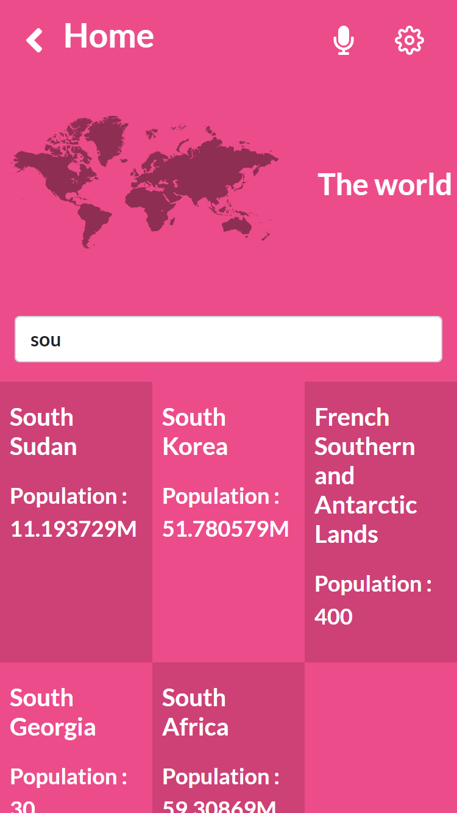
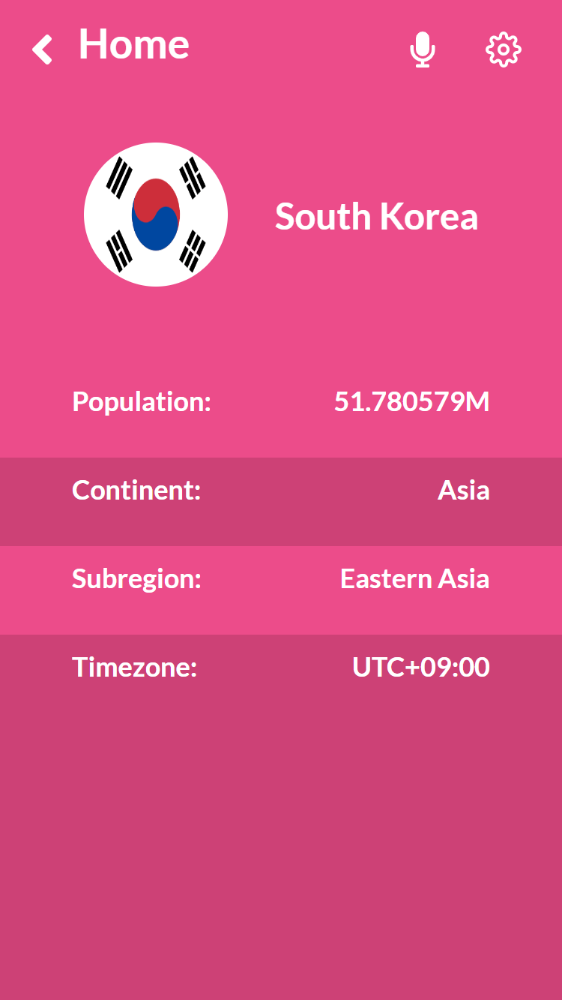

# Metrics WebApp
The App shows data from the world`s countries. You can search by name of country or select one to view the details like population, region, subregion, continent .


## Built With

- React (CRA)
- React Router Dom
- Redux Toolkit
- Bootstrap
- Rest API

## sneak peeks

 <br>

## Run the app in the development mode(Port 3000)

```
npm start
```

## Launches the test runner

```
npm test
```

## Builds the app for production

```
npm run build
```

## Demo App

**live demo** [Metrics Webapp](https://myelin0.github.io/Metrics-webapp/)

## Authors
👤 **Emirjeta Veisllari**
- GitHub: [@myelin0](https://github.com/myelin0)
- Twitter: [@Amy_Albania](https://twitter.com/Amy_albania)
- LinkedIn: [@Emirjeta Veisllari](https://www.linkedin.com/in/emirjeta-veisllari/)

## Credits

Thanks for [Nelson Sakwa](https://www.behance.net/sakwadesignstudio) for the time and effort to make UI design.

## Contributors

Contributions, issues, and feature requests are welcome!

Feel free to check the [issues page](https://github.com/myelin0/Metrics-webapp/issues).

## Show your support

Give a ⭐️ if you like this project!

## 📝 License

This project is under the [MIT](LICENSE) license.
